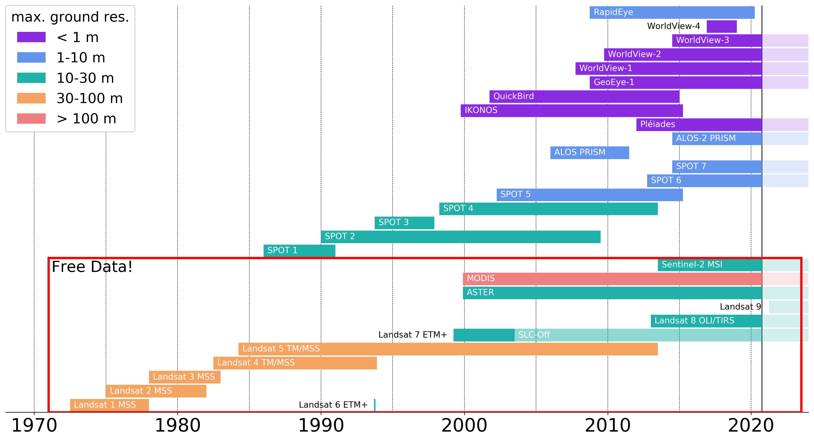

# Useful plots

These are a few plots that I've made that might prove to be useful for lectures, papers, etc.

## Satellite Mission diagram

satellite_mission_diagram.py creates the following:

If you uncomment the last few lines of the code, it will add a box around the free data:

## Planck Plot

planck_plot.py creates the following:

## Spectral Curves

spectral_plot.py plots, along with data from the ,
the spectral response curves for a variety of objects, as well as a band showing the visible portion of the EM spectrum.

