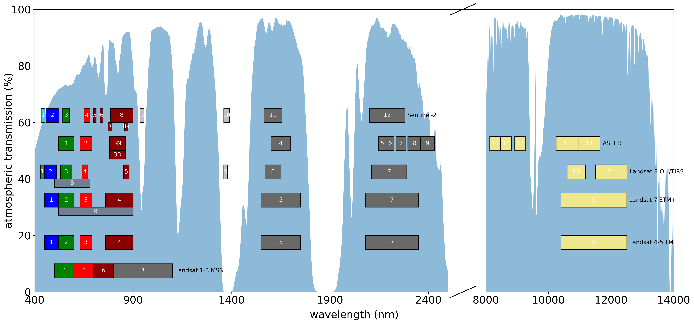

# Useful plots

These are a few plots that I've made that might prove to be useful for lectures, papers, etc.

## Satellite Mission diagram

satellite_mission_diagram.py creates the following:

If you uncomment the last few lines of the code, it will add a box around the free data:

## Planck Plot

planck_plot.py creates the following:

## Spectral Curves

spectral_plot.py plots, along with data from the [USGS Spectral Library](https://www.usgs.gov/energy-and-minerals/mineral-resources-program/science/usgs-high-resolution-spectral-library),
the spectral response curves for a variety of objects, as well as a band showing the visible portion of the EM spectrum.

## Atmospheric Transmission and Satellite Bands

transmission_plot.py plots makes a plot of satellite sensor bands, along with the atmospheric transmission as a function of wavelength. Transmission data are based on the [ASTM G-173 reference spectra](https://www.nrel.gov/grid/solar-resource/spectra-am1.5.html) for wavelengths <4000 nm, and the ATRAN<a href="#note1" id="note1ref">1</a> curves provided by the [Gemini Observatory](https://www.gemini.edu/observing/telescopes-and-sites/sites) for wavelengths >4000 nm.

Available for both VHR satellite (Worldview/Pleiades class, <5M GSD), and lower resolution remote sensing sattelites (Landsat/Sentinel-2 class).

### Footnotes
-----
<a id="note1" href="#note1ref">1</a>ATRAN modelling software (Lord, S.D. 1992, NASA Technical Memor. 103957)
