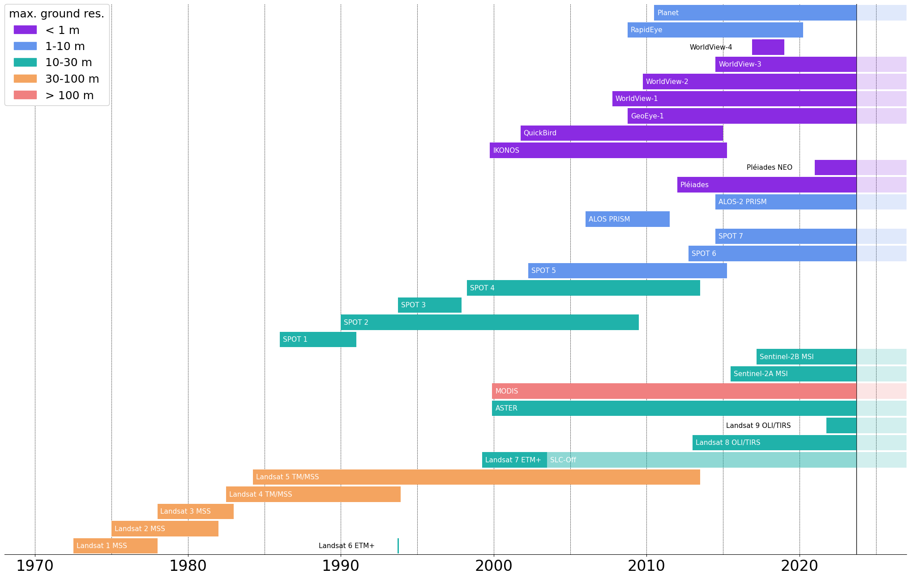
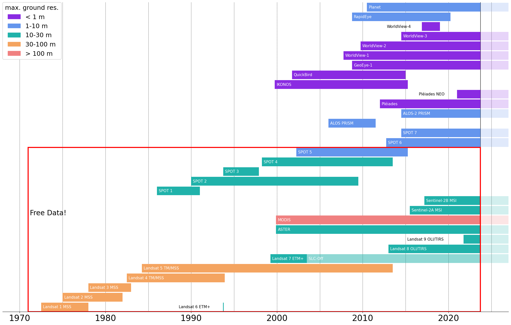
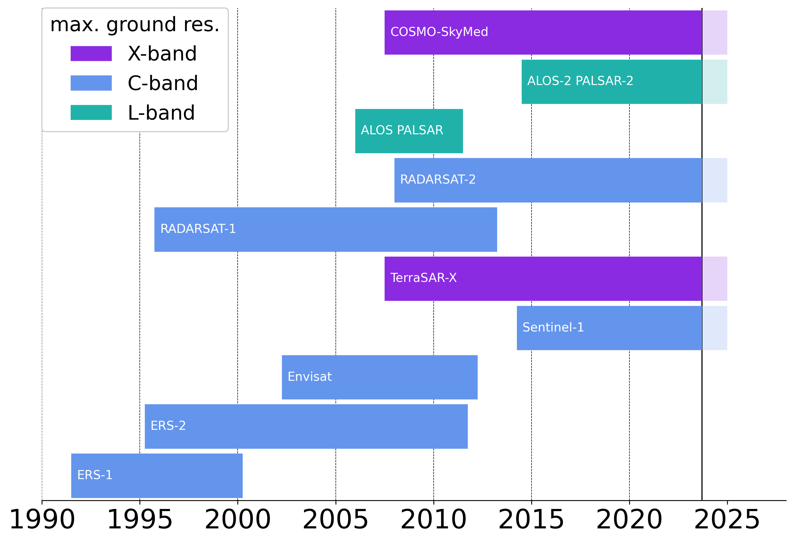
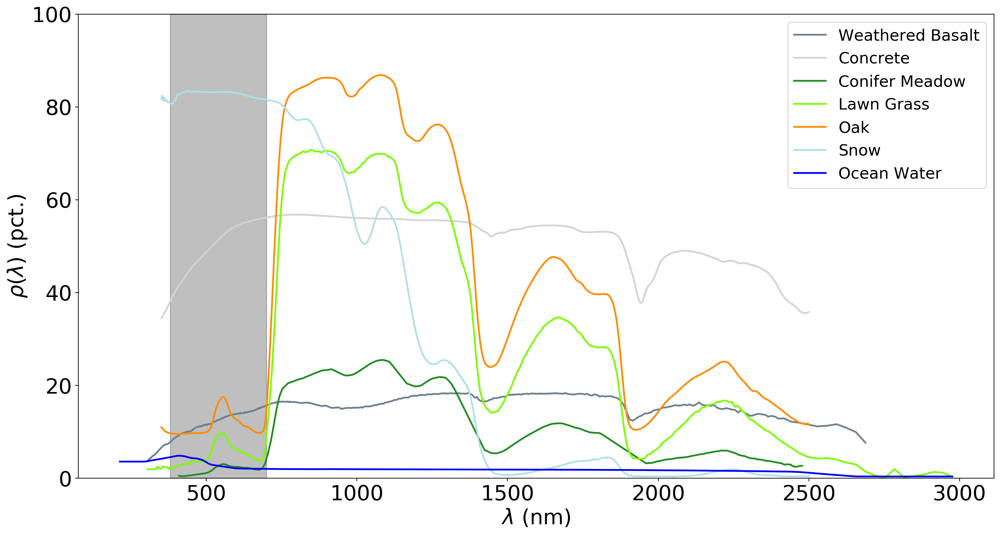
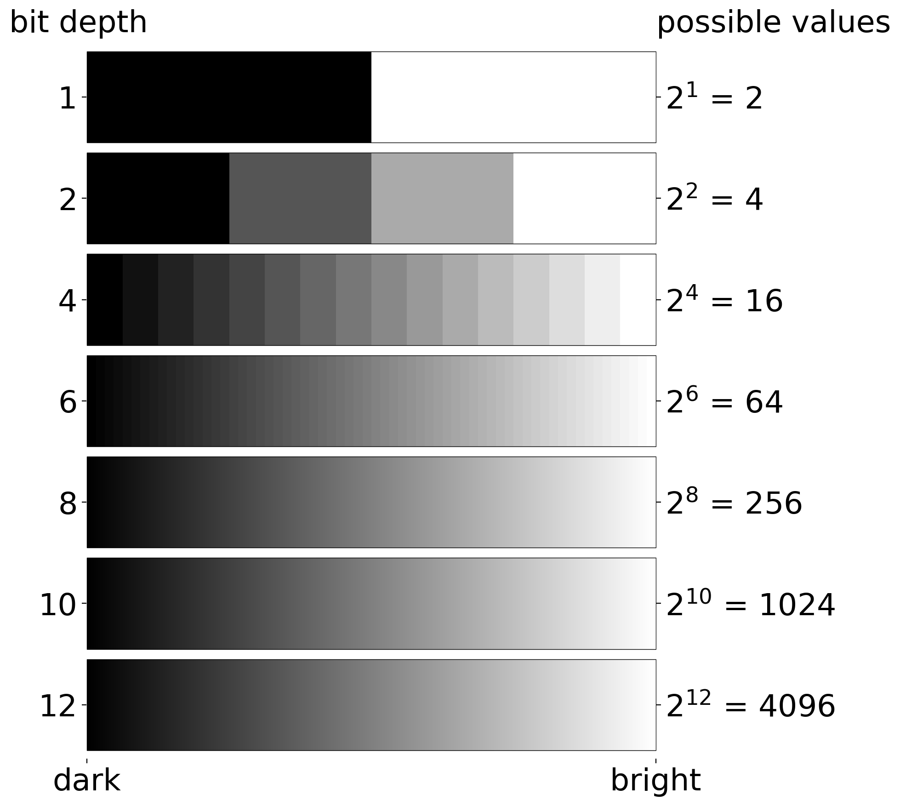
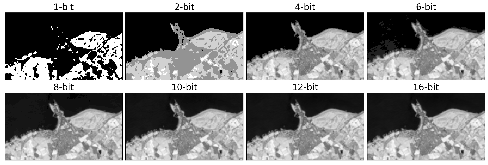
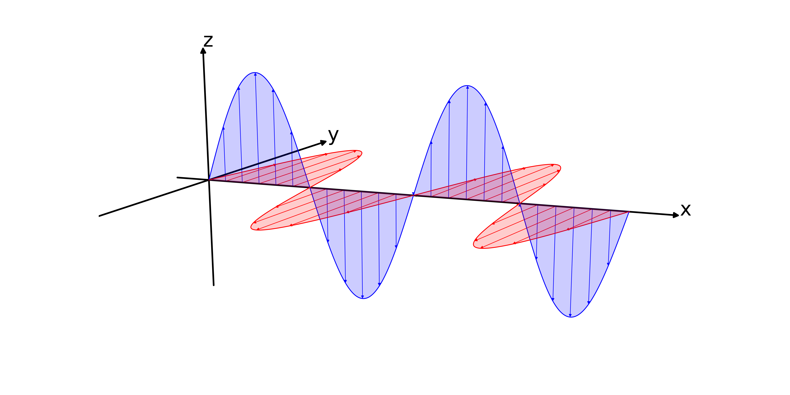

# Useful plots

These are a few plots that I've made that might prove to be useful for lectures, papers, etc. Please feel free to use
update, change, re-use, re-mix, etc.

To run a script, execute the following command from the local working directory of the repository:

```commandline
python scripts/{script}
```

This will save the output to the `figures` folder.

## Satellite Mission diagrams

`scripts/satellite_mission_diagram.py` creates the following:


If you uncomment the last few lines of the code, it will add a box around the free data:


`scripts/sar_mission_diagram.py` creates a similar plot, but for SAR satellite missions:



## Planck Plot

`scripts/planck_plot.py` creates the following:


## Spectral Curves

`scripts/spectral_plot.py` plots, along with data from the [USGS Spectral Library](https://www.usgs.gov/energy-and-minerals/mineral-resources-program/science/usgs-high-resolution-spectral-library),
the spectral response curves for a variety of objects, as well as a band showing the visible portion of the EM spectrum.




## Atmospheric Transmission and Satellite Bands

`scripts/transmission_plot.py` makes a plot of satellite sensor bands, along with the atmospheric transmission as a 
function of wavelength. Transmission data are based on the [ASTM G-173 reference spectra](https://www.nrel.gov/grid/solar-resource/spectra-am1.5.html) for wavelengths <4000 nm,
and the ATRAN<a href="#note1" id="note1ref"><sup>1</sup></a> curves provided by the [Gemini Observatory](https://www.gemini.edu/observing/telescopes-and-sites/sites) for 
wavelengths >4000 nm.

Available for both VHR satellite (Worldview/Pleiades class, <5M GSD), and lower resolution remote sensing satellites
(Landsat/Sentinel-2 class).


## Bit Depth

`scripts/bit_depth_diagram.py` makes a plot showing the ways of representing black to white using anywhere from 2 to 
2<sup>12</sup> colors.



`scripts/bit_depth_comparison.py` shows a similar thing, showing the same subset of a landsat scene (not included) 
using 2 to 2<sup>16</sup> colors.




## EM wave plot

`scripts/emr_wave_plot.py` plots a 3-d representation of an electromagnetic wave, with the electric component shown 
in blue and the magnetic component shown in red - though feel free to change the labelling if you prefer.




### Footnotes
-----
<a id="note1" href="#note1ref"><sup>1</sup></a>ATRAN modelling software (Lord, S.D. 1992, NASA Technical Memor. 103957)
