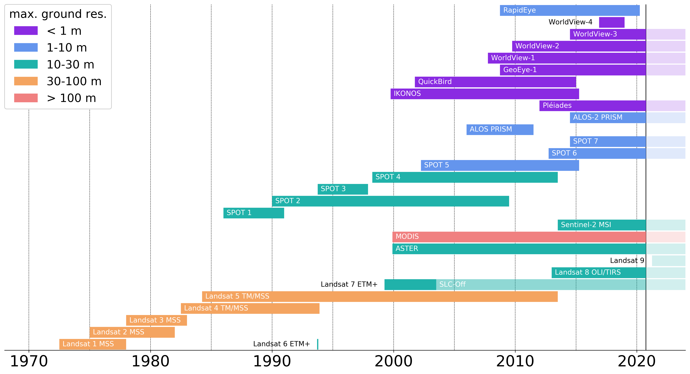
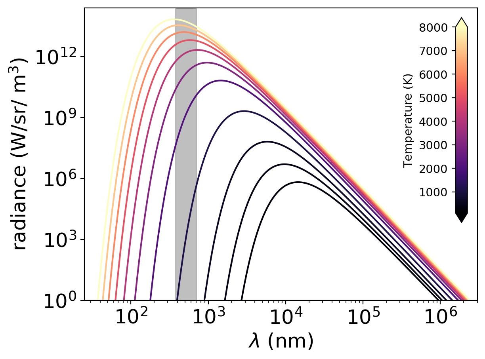

# Useful plots

These are a few plots that I've made that might prove to be useful for lectures, papers, etc.

## Satellite Mission diagram

satellite_mission_diagram.py creates the following:

## Planck Plot

planck_plot.py creates the following:

